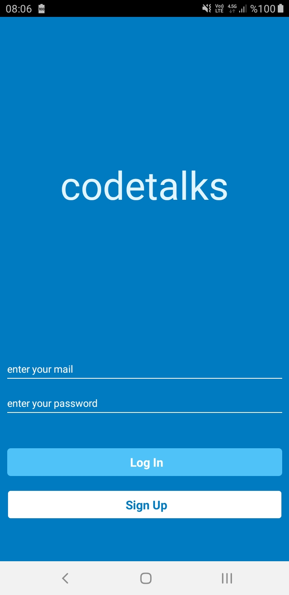
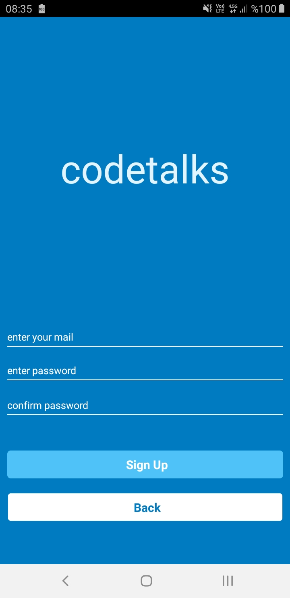
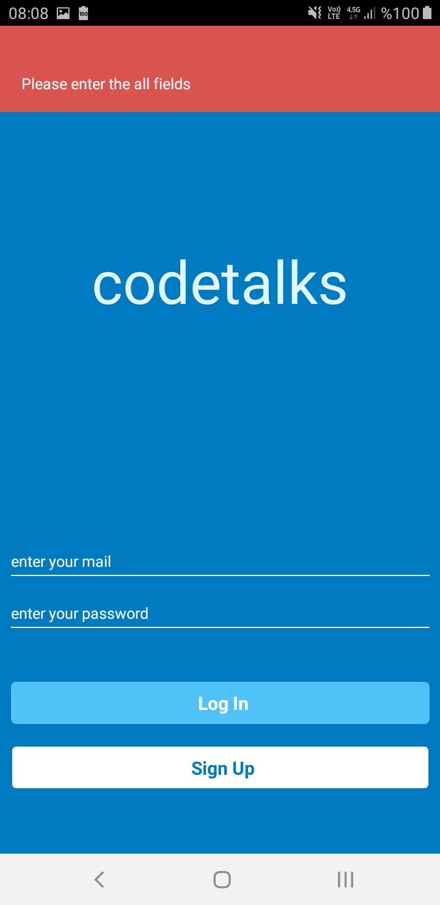
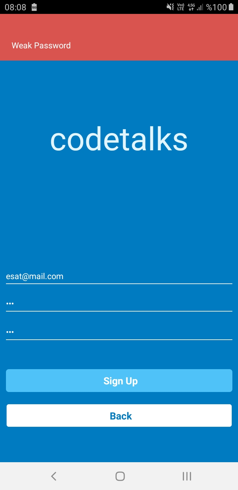
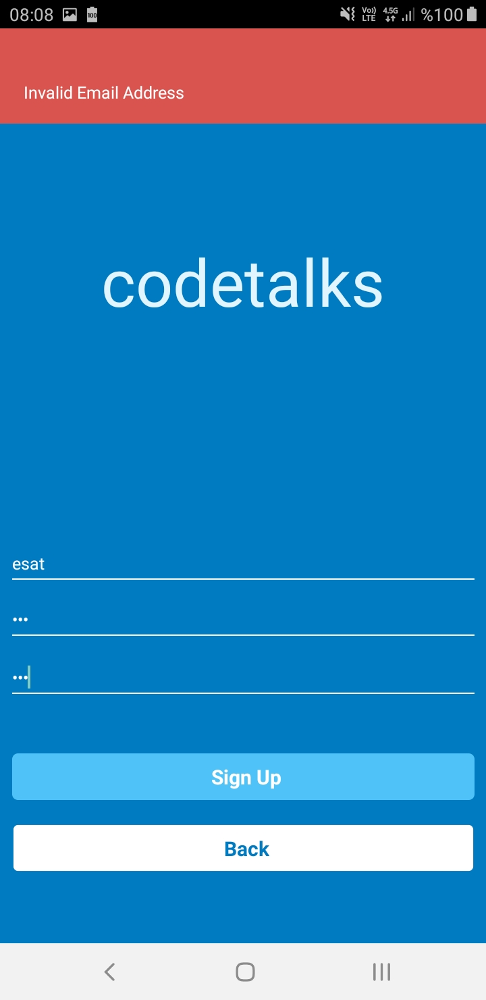
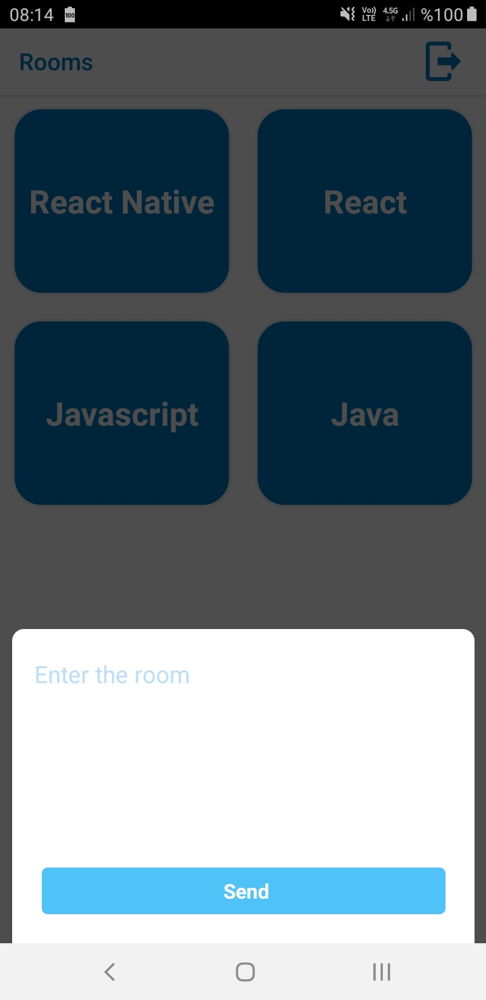
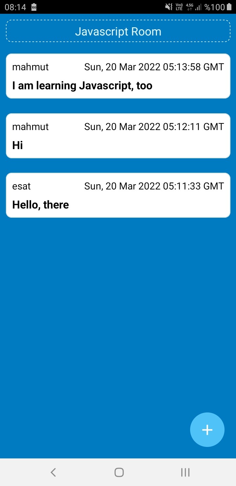
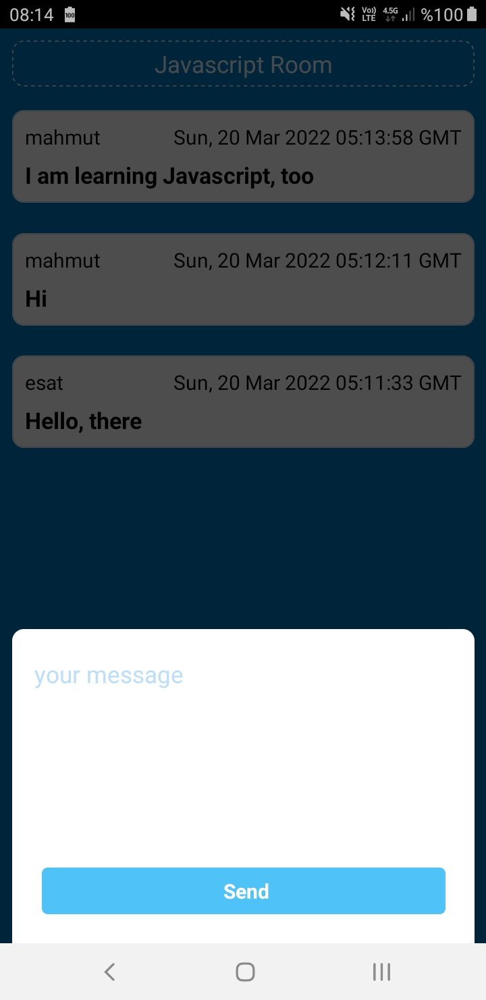

# codeTalks
- This project was created for patika.dev react-native camp homework.

# used in this project:
- FireBase (Authentication, Realtime Firebase)
- Banner Notification
- React Navigation
- Sending requests to API with Axios package
- Creating Custom Hooks
- Icons

# Login and SingUp page

# Rooms Page

# Messages Page

